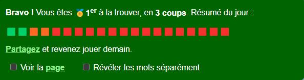

## Pedantix




## Usage

Install dependencies:
```bash
    git clone 
    pip install -r requirements.txt
```

Execute
```bash
    python solver/main.py -version pedantix
    python solver/main.py -version pedantle
```

1) Choose a version (pedantix or pedantle),
3) run main.py
4) New game starts at 12:00 for pedantix and 21:00 for pedantl (UTC+2).
